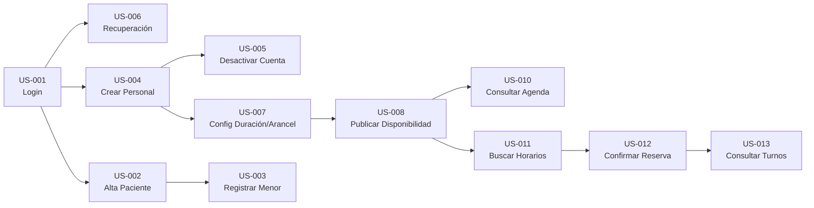
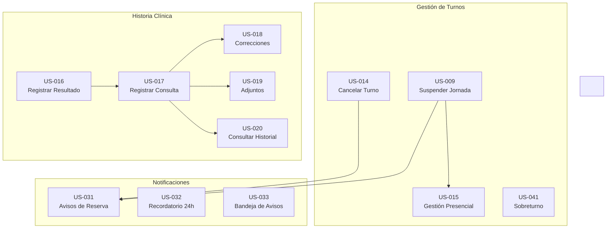
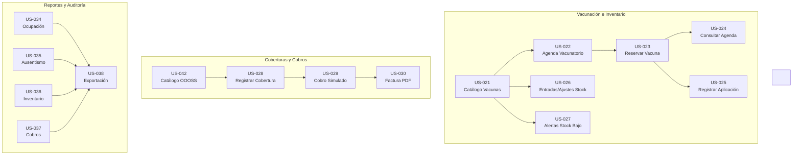

# Distribución de User Stories por Sprint — SIGSAM

**Proyecto:** Sistema Integral de Gestión para Sala Médica (SIGSAM)  
**Código:** PSS-2026-E2  
**Comisión:** 4 – Análisis y Management  
**Fecha:** 24/09/2026

---

## Resumen Ejecutivo

Se distribuyen las **40 User Stories** en 3 Sprints con un balance de **12 / 12 / 16 USs** respectivamente. La distribución respeta:

1. **Dependencias funcionales y técnicas** entre USs y RFs.  
2. **Coherencia de módulos**: las USs de un mismo flujo se agrupan en el mismo sprint.  
3. **Prioridad de requerimientos**: las USs asociadas a RF de prioridad Alta se concentran en Sprints 1 y 2\.  
4. **Capacidad del equipo**: Sprint 3 tiene 3 semanas (vs. 2 semanas de los anteriores), por lo que admite más USs.  
5. **Recomendación del Plan RSGR**: *"Asegurar el MVP en Sprint 1 y 2, dejando pagos y extras para el Sprint 3."*

&nbsp;

| Sprint | Duración | Fecha Demo | Fecha Entrega | USs | Enfoque |
| :---- | :---: | :---: | :---: | :---: | :---- |
| **Sprint 1** | 2 semanas | 08/10 | 11/10 | **12** | Base del sistema: login, cuentas, pacientes, agenda médica, búsqueda y reserva de turnos |
| **Sprint 2** | 2 semanas | 22/10 | 25/10 | **12** | Núcleo operativo: cancelación, gestión presencial, historia clínica, notificaciones |
| **Sprint 3** | 3 semanas | 12/11 | 15/11 | **16** | Complementarios: vacunación, cobros, reportes, auditoría |

---

## Sprint 1 — BASE DEL SISTEMA (12 USs)

> **Objetivo:** Tener el sistema mínimo funcional: un usuario puede loguearse, se pueden crear cuentas de personal y pacientes, los médicos pueden configurar y publicar su agenda, y los pacientes pueden buscar y reservar turnos.

### USs incluidas

| \# | ID | Título | Actor | RF | Prioridad RF | Justificación |
| :---: | :---- | :---- | :---- | :---: | :---: | :---- |
| 1 | **US-SIG-001** | Acceder al sistema y cerrar sesión | Usuario | RF-07 | 🔴 Alta | Punto de entrada a todo el sistema. El usuario no puede registrarse por sí mismo, solo iniciar sesión. |
| 2 | **US-SIG-006** | Recuperar acceso y cambiar contraseña | Admin / Usuario | RF-07 | 🔴 Alta | Complemento del login. Recuperación manual presencial. |
| 3 | **US-SIG-004** | Crear cuentas para el personal | Administrador | RF-06 | 🔴 Alta | Necesario para crear médicos, enfermeras y admins. |
| 4 | **US-SIG-005** | Desactivar una cuenta conservando registros | Administrador | RF-06 | 🔴 Alta | Complemento de la gestión de cuentas. Baja lógica sin perder datos. |
| 5 | **US-SIG-002** | Dar de alta a un paciente adulto | Administrador | RF-08 | 🔴 Alta | Alta asistida de pacientes por el administrador (única vía de registro). |
| 6 | **US-SIG-003** | Registrar a un menor y vincular a su tutor | Administrador | RF-08 | 🔴 Alta | Completa el circuito de registro de pacientes (menores). |
| 7 | **US-SIG-007** | Configurar duración y arancel de prestaciones | Administrador | RF-09 | 🔴 Alta | Prerrequisito para generar cupos en la agenda. |
| 8 | **US-SIG-008** | Publicar y ajustar disponibilidad mensual | Médico | RF-01 | 🔴 Alta | El médico carga sus 2 días semanales y publica cupos. Base de la agenda. |
| 9 | **US-SIG-010** | Consultar la agenda e identificar al paciente | Médico | RF-01 | 🔴 Alta | Vista de agenda diaria/mensual del médico. Punto de inicio de la atención. |
| 10 | **US-SIG-011** | Buscar horarios de consulta médica | Paciente / Tutor | RF-02 | 🔴 Alta | Inicio del flujo de reserva. Búsqueda por especialidad, médico, fecha. |
| 11 | **US-SIG-012** | Confirmar reserva médica sin duplicar cupo | Paciente / Tutor | RF-02 | 🔴 Alta | Reserva con retención de 5 min y confirmación definitiva. |
| 12 | **US-SIG-013** | Consultar próximos turnos y antecedentes | Paciente / Tutor | RF-02 | 🔴 Alta | Vista de turnos futuros y pasados del paciente. |

### Distribución por prioridad en Sprint 1

| Prioridad | Cantidad | Porcentaje |
| :---: | :---: | :---: |
| 🔴 Alta | 12 | 100% |
| 🟡 Media | 0 | 0% |
| 🟢 Baja | 0 | 0% |

### Flujo funcional del Sprint 1



### Qué se puede demostrar en la Demo Sprint 1 (08/10)

- ✅ Un administrador se loguea y crea cuentas de personal (médico, enfermera, admin)  
- ✅ Un administrador registra un paciente adulto y un menor con su tutor, proveyendo sus credenciales  
- ✅ Un paciente se loguea al sistema (sin posibilidad de autorregistro)  
- ✅ Un administrador configura duración y arancel para un médico  
- ✅ Un médico publica su disponibilidad mensual (2 días/semana)  
- ✅ Un médico consulta su agenda diaria y mensual  
- ✅ Un paciente busca horarios por especialidad, médico y fecha  
- ✅ Un paciente selecciona un turno, lo retiene 5 min y confirma la reserva  
- ✅ Un paciente consulta sus turnos futuros y pasados  
- ✅ Un administrador desactiva una cuenta  
- ✅ Un usuario recupera su contraseña con ayuda presencial del admin

---

## Sprint 2 — NÚCLEO OPERATIVO (12 USs)

> **Objetivo:** Completar el flujo de turnos médicos (cancelación, gestión presencial, sobreturnos), habilitar la historia clínica y las notificaciones. Con Sprint 1 \+ Sprint 2, el sistema cubre el 100% del MVP.

### USs incluidas

| \# | ID | Título | Actor | RF | Prioridad RF | Justificación |
| :---: | :---- | :---- | :---- | :---: | :---: | :---- |
| 1 | **US-SIG-014** | Cancelar un turno propio | Paciente / Tutor | RF-11 | 🔴 Alta | Cancelación con 24 hs de anticipación. Libera cupo. |
| 2 | **US-SIG-009** | Suspender una jornada médica | Médico / Admin | RF-10 | 🟡 Media | Gestión de imprevistos. Bloquea jornada y avisa a pacientes. |
| 3 | **US-SIG-015** | Gestionar solicitudes presenciales y reprogramaciones | Personal autorizado | RF-12 | 🟡 Media | Reservas asistidas, cancelaciones presenciales y reprogramación. |
| 4 | **US-SIG-041** | Asignar un sobreturno | Administrador | RF-22 | 🟢 Baja | Turnos de excepción sobre horario ocupado. Máx 2 por médico/día. |
| 5 | **US-SIG-016** | Registrar resultado real de una cita | Médico / Enfermería | RF-13 | 🔴 Alta | Marca Atendido (al guardar consulta) o Ausente (manual). |
| 6 | **US-SIG-017** | Registrar una consulta médica | Médico | RF-04 | 🔴 Alta | Documentar atención: diagnóstico obligatorio \+ campos opcionales. |
| 7 | **US-SIG-018** | Incorporar corrección a una consulta | Médico | RF-04 | 🔴 Alta | Correcciones no destructivas con motivo, autor, fecha. |
| 8 | **US-SIG-019** | Adjuntar documentación a una consulta | Médico | RF-04 | 🔴 Alta | Adjuntar PDF/JPG/PNG hasta 10 MB a consultas propias. |
| 9 | **US-SIG-020** | Consultar historial del paciente representado | Paciente / Tutor | RF-04 | 🔴 Alta | Vista de solo lectura del historial clínico. |
| 10 | **US-SIG-031** | Recibir avisos sobre reserva y cambios | Paciente / Tutor | RF-19 | 🔴 Alta | Emails y avisos internos por confirmación, cancelación, suspensión. |
| 11 | **US-SIG-032** | Recibir recordatorio antes del turno | Paciente / Tutor | RF-19 | 🔴 Alta | Recordatorio 24 hs antes. Objetivo POS: reducir ausentismo 40%. |
| 12 | **US-SIG-033** | Consultar avisos dentro del sistema | Usuario | RF-19 | 🔴 Alta | Bandeja de notificaciones por usuario. Leído / No leído. |

### Distribución por prioridad en Sprint 2

| Prioridad | Cantidad | Porcentaje |
| :---: | :---: | :---: |
| 🔴 Alta | 9 | 75% |
| 🟡 Media | 2 | 17% |
| 🟢 Baja | 1 | 8% |

### Flujo funcional del Sprint 2



### Qué se puede demostrar en la Demo Sprint 2 (22/10)

- ✅ El paciente cancela un turno con más de 24 hs de anticipación  
- ✅ Un médico suspende una jornada y los pacientes afectados son notificados  
- ✅ Un administrador reprograma un turno de una jornada suspendida  
- ✅ Un administrador asigna un sobreturno sobre un horario ya ocupado  
- ✅ Un médico registra una consulta médica con diagnóstico  
- ✅ Un médico agrega una corrección a una consulta anterior  
- ✅ Un médico adjunta un PDF a una consulta  
- ✅ Un paciente visualiza su historial clínico en solo lectura  
- ✅ El paciente recibe email y aviso interno al confirmar/cancelar turno  
- ✅ Se envía recordatorio 24 hs antes del turno  
- ✅ El paciente consulta su bandeja de notificaciones

---

## Sprint 3 — VACUNACIÓN, COBROS, REPORTES Y AUDITORÍA (16 USs)

> **Objetivo:** Completar los módulos complementarios: circuito completo de vacunación, coberturas y cobros simulados, reportes administrativos y bitácora de auditoría. Sprint 3 tiene **3 semanas** de duración.

### USs incluidas

| \# | ID | Título | Actor | RF | Prioridad RF | Justificación |
| :---: | :---- | :---- | :---- | :---: | :---: | :---- |
|  |  | **Vacunación e Inventario** |  |  |  |  |
| 1 | **US-SIG-021** | Mantener catálogo de vacunas | Enfermería | RF-03 | 🟡 Media | ABM de vacunas con umbrales de alerta. Base del módulo. |
| 2 | **US-SIG-022** | Ofrecer horarios del vacunatorio | Enfermería | RF-14 | 🟡 Media | Agenda compartida con cupos de 15 min. |
| 3 | **US-SIG-023** | Reservar aplicación con cupo y dosis | Paciente / Tutor / Enfermería | RF-15 | 🟡 Media | Reserva de vacuna con compromiso de dosis. |
| 4 | **US-SIG-024** | Consultar agenda y pendientes del vacunatorio | Enfermería | RF-14 | 🟡 Media | Vista operativa del vacunatorio. Pendientes de registro. |
| 5 | **US-SIG-025** | Registrar vacuna aplicada | Enfermería | RF-16 | 🟡 Media | Registro de aplicación, descuento de stock por lote. |
| 6 | **US-SIG-026** | Registrar entradas y ajustes de inventario | Enfermería | RF-03 | 🟡 Media | Movimientos de stock: compras, ajustes, trazabilidad por lote. |
| 7 | **US-SIG-027** | Definir umbral y recibir alertas de stock bajo | Enfermería | RF-03 | 🟡 Media | Alerta a Enfermería cuando disponible ≤ umbral. |
|  |  | **Coberturas, Cobros y Comprobantes** |  |  |  |  |
| 8 | **US-SIG-041**\* | Administrar catálogo de obras sociales | Administrador | RF-17 | 🟡 Media | ABM de obras sociales/prepagas. Activa/Inactiva. |
| 9 | **US-SIG-028** | Registrar cobertura y seleccionar modalidad | Paciente / Tutor / Admin | RF-18 | 🟡 Media | Vincular obra social al paciente. Particular vs. Con cobertura. |
| 10 | **US-SIG-029** | Registrar cobro presencial simulado | Administrador | RF-05 | 🟡 Media | Cobro simulado con resultado Aprobado/Rechazado/Cancelado. |
| 11 | **US-SIG-030** | Consultar y descargar factura simulada | Paciente / Tutor | RF-05 | 🟡 Media | Descarga de factura PDF simulada. |
|  |  | **Reportes y Auditoría** |  |  |  |  |
| 12 | **US-SIG-034** | Analizar turnos asignados y ocupación | Administrador | RF-20 | 🟡 Media | Reporte de ocupación por médico/especialidad. |
| 13 | **US-SIG-035** | Comparar asistencia, ausencias y recordatorios | Administrador | RF-20 | 🟡 Media | Reporte de ausentismo vs. recordatorios. |
| 14 | **US-SIG-036** | Consultar inventario actual y evolución | Administrador | RF-20 | 🟡 Media | Reporte de stock de vacunas y movimientos. |
| 15 | **US-SIG-037** | Consultar cobros y prestaciones con cobertura | Administrador | RF-20 | 🟡 Media | Reporte de facturación y coberturas. |
| 16 | **US-SIG-038** | Exportar reporte autorizado | Admin / Médico | RF-20 | 🟡 Media | Exportación a PDF y Excel de cualquier reporte. |

> **Nota sobre US-SIG-039 (Bitácora de auditoría):** Se recomienda que el **registro** de auditoría se implemente desde Sprint 1 (como log transversal), y la **consulta/filtrado** de la bitácora (US-SIG-039, RF-21) se incorpore como tarea adicional dentro de Sprint 3\.

> **⚠️ Nota sobre ID duplicado:** El ID `US-SIG-041` se usa para dos USs diferentes: "Asignar sobreturno" (Sprint 2\) y "Administrar catálogo de obras sociales" (Sprint 3). Se recomienda renumerar el catálogo como **US-SIG-042**.

### Distribución por prioridad en Sprint 3

| Prioridad | Cantidad | Porcentaje |
| :---: | :---: | :---: |
| 🔴 Alta | 0 | 0% |
| 🟡 Media | 16 | 100% |
| 🟢 Baja | 0 | 0% |

### Flujo funcional del Sprint 3



### Qué se puede demostrar en la Demo Sprint 3 (12/11)

- ✅ Enfermería crea vacunas en el catálogo, define umbrales y publica agenda del vacunatorio  
- ✅ Un paciente reserva un turno de vacunación (con compromiso de dosis)  
- ✅ Enfermería registra la aplicación de una vacuna (descuenta stock por lote)  
- ✅ Se genera alerta de stock bajo cuando disponible ≤ umbral  
- ✅ Un administrador crea obras sociales en el catálogo  
- ✅ Un paciente registra su cobertura y reserva con modalidad "Con cobertura"  
- ✅ Un administrador registra un cobro simulado y se genera factura PDF  
- ✅ El paciente descarga su factura simulada  
- ✅ Un administrador genera reportes de ocupación, ausentismo, inventario y cobros  
- ✅ Se exportan reportes a PDF y Excel  
- ✅ Un administrador consulta la bitácora de auditoría

---

## Resumen Visual Completo

````carousel
### Sprint 1 — BASE DEL SISTEMA
**12 USs · 2 semanas · Demo 08/10**

&nbsp;

| Módulo | USs |
|--------|-----|
| 🔐 Autenticación | US-001, US-006 |
| 👥 Cuentas y Pacientes | US-002, US-003, US-004, US-005 |
| 📅 Agenda Médica | US-007, US-008, US-010 |
| 🎫 Búsqueda y Reserva | US-011, US-012, US-013 |

&nbsp;

**RFs cubiertos:** RF-01, RF-02, RF-06, RF-07, RF-08, RF-09
<!-- slide -->
### Sprint 2 — NÚCLEO OPERATIVO
**12 USs · 2 semanas · Demo 22/10**

&nbsp;

| Módulo | USs |
|--------|-----|
| 🎫 Gestión de Turnos | US-009, US-014, US-015, US-041 |
| 🏥 Historia Clínica | US-016, US-017, US-018, US-019, US-020 |
| 🔔 Notificaciones | US-031, US-032, US-033 |

&nbsp;

**RFs cubiertos:** RF-04, RF-10, RF-11, RF-12, RF-13, RF-19, RF-22
<!-- slide -->
### Sprint 3 — COMPLEMENTARIOS
**16 USs · 3 semanas · Demo 12/11**

&nbsp;

| Módulo | USs |
|--------|-----|
| 💉 Vacunación | US-021 a US-027 |
| 💳 Coberturas/Cobros | US-042, US-028, US-029, US-030 |
| 📊 Reportes | US-034 a US-038 |
| 📋 Auditoría | US-039 (transversal) |

&nbsp;

**RFs cubiertos:** RF-03, RF-05, RF-14 a RF-18, RF-20, RF-21
````

---

## Tabla Completa de USs con Sprint Asignado

| ID | Título | Actor Principal | RF | Prior. | Sprint |
| :---- | :---- | :---- | :---: | :---: | :---: |
| US-SIG-001 | Acceder al sistema y cerrar sesión | Usuario | RF-07 | Alta | **1** |
| US-SIG-002 | Dar de alta a un paciente adulto | Administrador | RF-08 | Alta | **1** |
| US-SIG-003 | Registrar a un menor y vincular a su tutor | Administrador | RF-08 | Alta | **1** |
| US-SIG-004 | Crear cuentas para el personal | Administrador | RF-06 | Alta | **1** |
| US-SIG-005 | Desactivar una cuenta conservando registros | Administrador | RF-06 | Alta | **1** |
| US-SIG-006 | Recuperar acceso y cambiar contraseña | Admin / Usuario | RF-07 | Alta | **1** |
| US-SIG-007 | Configurar duración y arancel | Administrador | RF-09 | Alta | **1** |
| US-SIG-008 | Publicar y ajustar disponibilidad mensual | Médico | RF-01 | Alta | **1** |
| US-SIG-009 | Suspender una jornada médica | Médico / Admin | RF-10 | Media | **2** |
| US-SIG-010 | Consultar la agenda e identificar al paciente | Médico | RF-01 | Alta | **1** |
| US-SIG-011 | Buscar horarios de consulta médica | Paciente / Tutor | RF-02 | Alta | **1** |
| US-SIG-012 | Confirmar reserva médica | Paciente / Tutor | RF-02 | Alta | **1** |
| US-SIG-013 | Consultar próximos turnos y antecedentes | Paciente / Tutor | RF-02 | Alta | **1** |
| US-SIG-014 | Cancelar un turno propio | Paciente / Tutor | RF-11 | Alta | **2** |
| US-SIG-015 | Gestionar solicitudes presenciales y reprogramaciones | Personal autorizado | RF-12 | Media | **2** |
| US-SIG-016 | Registrar resultado real de una cita | Médico / Enfermería | RF-13 | Alta | **2** |
| US-SIG-017 | Registrar una consulta médica | Médico | RF-04 | Alta | **2** |
| US-SIG-018 | Incorporar corrección a una consulta | Médico | RF-04 | Alta | **2** |
| US-SIG-019 | Adjuntar documentación a una consulta | Médico | RF-04 | Alta | **2** |
| US-SIG-020 | Consultar historial del paciente representado | Paciente / Tutor | RF-04 | Alta | **2** |
| US-SIG-021 | Mantener catálogo de vacunas | Enfermería | RF-03 | Media | **3** |
| US-SIG-022 | Ofrecer horarios del vacunatorio | Enfermería | RF-14 | Media | **3** |
| US-SIG-023 | Reservar aplicación con cupo y dosis | Pac. / Tutor / Enf. | RF-15 | Media | **3** |
| US-SIG-024 | Consultar agenda y pendientes del vacunatorio | Enfermería | RF-14 | Media | **3** |
| US-SIG-025 | Registrar vacuna aplicada | Enfermería | RF-16 | Media | **3** |
| US-SIG-026 | Registrar entradas y ajustes de inventario | Enfermería | RF-03 | Media | **3** |
| US-SIG-027 | Definir umbral y alertas de stock bajo | Enfermería | RF-03 | Media | **3** |
| US-SIG-028 | Registrar cobertura y seleccionar modalidad | Pac. / Tutor / Admin | RF-18 | Media | **3** |
| US-SIG-029 | Registrar cobro presencial simulado | Administrador | RF-05 | Media | **3** |
| US-SIG-030 | Consultar y descargar factura simulada | Paciente / Tutor | RF-05 | Media | **3** |
| US-SIG-031 | Recibir avisos sobre reserva y cambios | Paciente / Tutor | RF-19 | Alta | **2** |
| US-SIG-032 | Recibir recordatorio antes del turno | Paciente / Tutor | RF-19 | Alta | **2** |
| US-SIG-033 | Consultar avisos dentro del sistema | Usuario | RF-19 | Alta | **2** |
| US-SIG-034 | Analizar turnos y ocupación de agenda | Administrador | RF-20 | Media | **3** |
| US-SIG-035 | Comparar asistencia, ausencias y recordatorios | Administrador | RF-20 | Media | **3** |
| US-SIG-036 | Consultar inventario actual y evolución | Administrador | RF-20 | Media | **3** |
| US-SIG-037 | Consultar cobros y prestaciones con cobertura | Administrador | RF-20 | Media | **3** |
| US-SIG-038 | Exportar reporte autorizado | Admin / Médico | RF-20 | Media | **3** |
| US-SIG-039 | Consultar bitácora de operaciones | Administrador | RF-21 | Media | **3** |
| US-SIG-041 | Asignar sobreturno | Administrador | RF-22 | Baja | **2** |
| US-SIG-042 | Administrar catálogo de obras sociales | Administrador | RF-17 | Media | **3** |

---

## Riesgos y Contingencia por Sprint

| Sprint | Riesgo Principal | Contingencia |
| :---- | :---- | :---- |
| **Sprint 1** | Retrasos en login/autenticación bloquean todo | Priorizar US-001 y US-004 en la primera semana |
| **Sprint 2** | Complejidad del flujo de reserva con retención temporal | Si no llega, postergar US-041 (sobreturno) a Sprint 3 |
| **Sprint 3** | Alcance amplio (16 USs en 3 semanas) | Si no llega, postergar reportes (US-034 a US-038) como primera medida. Luego cobros (US-029, US-030) |

> La regla del Plan RSGR aplica: *"Si las desviaciones comprometen el objetivo del Sprint, sacar lo de menor prioridad — nunca bajar la calidad."*